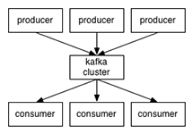
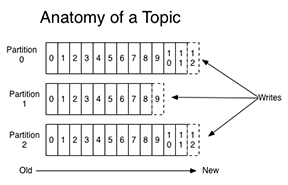
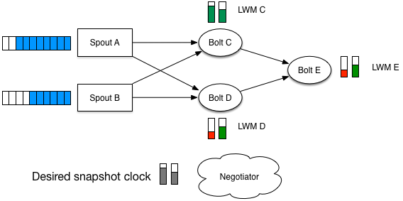

name: inverse
layout: true
class: center, middle, inverse

---

template: inverse

background-image: url(images/storm_clouds_intro.jpg)

# Hailstorm

## Distributed stream processing with exactly-once semantics

Thomas Dimson & Milind Ganjoo

---

layout: false
class: center

# A Guessing Game

.full-width-image[]

.medium[What do these have in common?]

---

layout: false

# Outline

1. Introduction
2. Background
3. Architecture
4. Exactly Once Semantics
5. Topologies
6. Demo
7. Sayonara

---

layout: true

# Introduction

---

## Batch Processing?

* We all know ~~and love~~ Hadoop

* Hadoop is all about offline computation. Log a bunch of data, make a cron job nightly
  to fan out a bunch of queries and give insight into the data

* Hadoop is used as a way to sub-divide a job into components that operate on different machines

  * E.g. Apache Giraph, Hive, etc. 

  * On machine / job failure, the job rescheduled somewhere else 

---

## Stream Processing!?

* Hadoop is completely inappropriate for real-time computation

  * E.g., trending topics on Twitter, who is on my website?

* Stream processing: performing computation as reaction to an infinite
  stream of input (analogy: `generators` in Python, `Pipes` in Haskell)

* Difficult to scale beyond a single machine: failures cascade, state gets lost

* Real-world apps typically use a hodge-podge of:
  * Queues: Kafka, RabbitMQ, ActiveMQ
  * Logging middleware: Scribe, Flume
  * Messaging middleware: Thrift, Protocol Buffers


---

## Distributed Stream Processing

* Disciplined approach to streaming computation across multiple machines
  in the presence of machine failures, network hiccups, etc.

* Pioneer: [Storm](http://storm.incubator.apache.org/) by Apache/Twitter/Back-type/Nathan Marz

  * Divides the world into Sources (spouts) and units of computation (Bolts) 

  * Each processor receives a tuple as input, and may or may not send a tuple as output

  * E.g, find frequently occuring words in tweets, and produce a list of trending topics


* Pitfalls

  * State management is left to you (how to recover on failure?)

  * At-least-once semantics: you may receive the same tuple twice

---

template: inverse

background-image: url(images/storm_clouds_2.jpg)

# Still with us?


---

layout: false

.float-right-slide-widget[

# Background

## Zookeeper
]

* Highly available distributed system for coordination 
  .tiny[(the most used system you have never heard of)]

* Exposes a file system-like interface with files (aka nodes) 
  replicated across different machines

* Ephemeral nodes: files that disappear when a connection does

  * We register our processor into a node, and when it crashes the node *disappears*

* Node watchers: asynchronous notifications
  * A program can set a watcher and get notified whenever a node gets deleted or 
    modified, or directory contents change

* Haskell bindings [hzk](https://github.com/dgvncsz0f/hzk) are semi-okay!


---

.float-right-slide-widget-wide[


# Background

## Kafka
]

* Acts like a message queue, except old messages do not get popped
.center[]

* Each incoming message gets routed to a different *partition*, wherein
  they are linearly ordered with an *offset*
.center[]


---
.float-right-slide-widget[

# Background

## Haskakafka
]

* :( No up-to-date Kafka bindings for Haskell

* :) empowered C FFI-ers, write our own and name it [Haskakafka](https://github.com/cosbynator/haskakafka)

--

* ''How bad could it be?''

--

.small-code[
```
{#fun unsafe rd_kafka_produce_batch as ^
    {`RdKafkaTopicTPtr', cIntConv `CInt32T', `Int', 
     `RdKafkaMessageTPtr', `Int'} -> `Int' #}
instance Storable RdKafkaMessageT where
    alignment _ = {#alignof rd_kafka_message_t#}
    sizeOf _ = {#sizeof rd_kafka_message_t#}
    peek p = RdKafkaMessageT
        <*> liftM fromIntegral ({#get rd_kafka_message_t->partition #} p)
        <*> liftM fromIntegral ({#get rd_kafka_message_t->len #} p)
        <*> liftM fromIntegral ({#get rd_kafka_message_t->offset#} p)
        <*> liftM castPtr ({#get rd_kafka_message_t->payload#} p)
    poke p x = do
      {#set rd_kafka_message_t.partition#} p
          (fromIntegral $ partition'RdKafkaMessageT x)
      {#set rd_kafka_message_t.len#} p (fromIntegral $ len'RdKafkaMessageT x)
      {#set rd_kafka_message_t.offset#} p
          (fromIntegral $ offset'RdKafkaMessageT x)
      {#set rd_kafka_message_t.payload#} p (castPtr $ payload'RdKafkaMessageT x)
```
]

---

.float-right-slide-widget[

# Background

## Storm
]

* Distributed stream processor with at-least-once semantics

.center[]

* Our project uses the same nomenclature, a similar design but
  is implemented independently Haskell and provides exactly-once semantics

---

template: inverse

background-image: url(images/storm_clouds_3.jpg)

# Enter Hailstorm

---

layout: true

# Architecture

---
## Running Example

Image goes here

---
## Exactly Once / Vector Clocks

* Hailstorm operates with exactly once semantics without fine-grained
  locking or synchronization

* To do this, inner computation is restricted to _commutative_ _monoids_

* Time is represented with a vector clock, each component being a Kafka
  offset

* Periodically, the bolts snapshot their state along with the vector clock. On
  failure, we restore snapshots to each bolt and rewind the spouts to the snapshot clock. 
  
.footnote[Details hashed out in the coming slides]

---

## Spouts

* Spouts are responsible for getting data into the Hailstorm system

* Each spout is locked to a single Kafka partition, performs data
  deserialization and forwards tuples along with their offsets to downstreams

* Downstreams partition the space (''bieber'' always goes to the same downstream,
  so no individual processor gets overloaded)

* Because Kafka retains data indefinitely, the spouts are able to rewind
  to a previous time. 

* After Hailstorm initialization, spouts are rewound to the last good snapshot
  of the system.

* Users of Hailstorm specify a pure deserialization function and all
  impure operations are handled internally.

---

layout: false

.float-right-slide-widget-narrowest[

# Architecture
## Bolts
]

* Hailstorm &lt;3 monoids: represent bolt state using a _commutative_ monoid

* Each incoming tuple is merged with state (`mappend`, but commutative)

* Whenever negotiator publishes a new `desiredSnapshotClock`:
    1. Make two states, A and B (A = current state, B = `mempty`)
    2. For each incoming tuple:
      1. If tuple offset &lt;= (`desiredSnapshotClock ! partition`), merge into A
      2. Otherwise, merge into B

* When A no longer changes, it is time to save a snapshot. Then:
    1. Fork thread to save A
    2. Revert to one state: A `mappend` B

--

_But when can we guarantee that A will no longer change?_

---

# Architecture
## Low water mark (LWM)

* Low water mark = `Map Partition Offset` (same as a Clock)

* Each payload carries collection of LWMs for every upstream worker.

* `\(p^\textrm{th}\)` entry for LWM at node _n_  = minimum offset for partition
  _p_ across all upstream LWMs
    * At spout level, LWM[p] is simply the offset in the associated partition _p_
    * At bolt level, LWM[p] = min(L[p] _for each_ L in upstream LWMs)

.center[]

---

# Architecture
## Deciding when to save a snapshot



* Bolt can save a snapshot iff its LWM equals the desired snapshot clock in
  _all_ dimensions
  * Bolt C's LWM = desired snapshot clock: .green[**save**]
  * Bolt D's LWM &lt;= desired snapshot clock: .red[**wait**]
  * Bolt E's LWM = min(LWM C, LWM D) &lt;= desired snapshot clock: .red[**wait**]

---

# Architecture
## Sinks

* Sinks are the gateway to the real world - after all computation is finished,
  they perform user-specified actions

* They receive tuples from upstream bolts are are able to perform any kind
  of computation they want on the tuples

* Unlike bolts, they are not snapshotted and non-idempotent operations may result
  in real-world issues.

* Sinks are the only part of the Hailstorm system where a user is allowed to 
  execute impure code.

---

layout: false

.float-right-slide-widget-narrower[

# Architecture
## The *Negotiator*
]


* Negotiator is responsible for co-ordinating snapshots, gating spouts, 
  and error handling (communicating via Zookeeper)

* Snapshot negotiation:

--

  * Pause spouts

--

  * Form next snapshot clock from the last spout offsets

--

  * Resume spouts, tell the bolts about the clock

--

* Error handling / boot-up:

--

  * Monitor a list of alive processors (Zookeeper ephemeral nodes)

--

  * Pause the world unless everyone is alive

--

  * Otherwise, wait for bolts to load snapshots and start flowing

--
  
  * If processor dies, then reboot the world into the initial state


---

template: inverse

background-image: url(images/storm_clouds_4.jpg)

# Demo

---

layout: true

# Sayonara

---

## Next Steps

* More flexibility in specifying topologyies

  * Currently have to specify IP address / port

* Seperate topology logic from groups of machine

  * Like hadoop, it would be nice to separate the *job* from *hailstorm*
  * Could also support client bolt specification in Zookeeper

* More robustness

  * Sensitive to Zookeeper timings

---

template: inverse

background-image: url(images/storm_clouds_5.jpg)

# Hailstorm
## https://github.com/hailstorm-hs/hailstorm
## https://github.com/cosbynator/haskakafka
## @mganjoo @cosbynator
